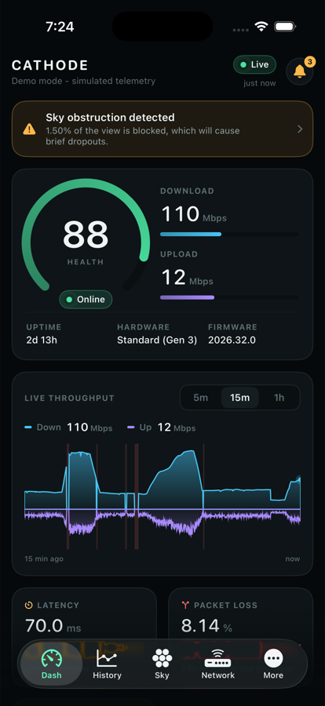
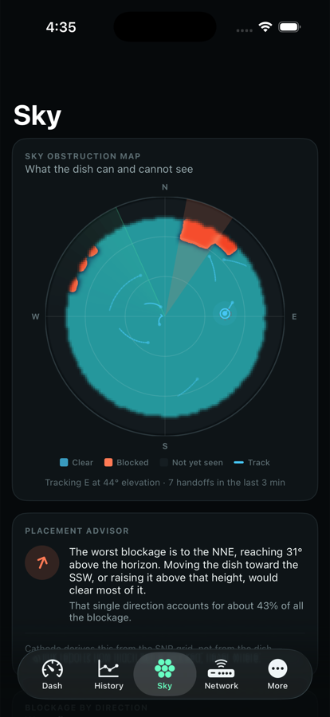
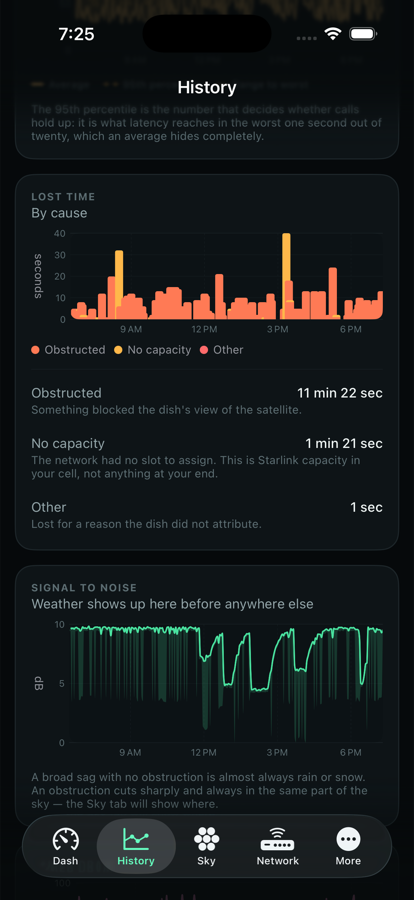
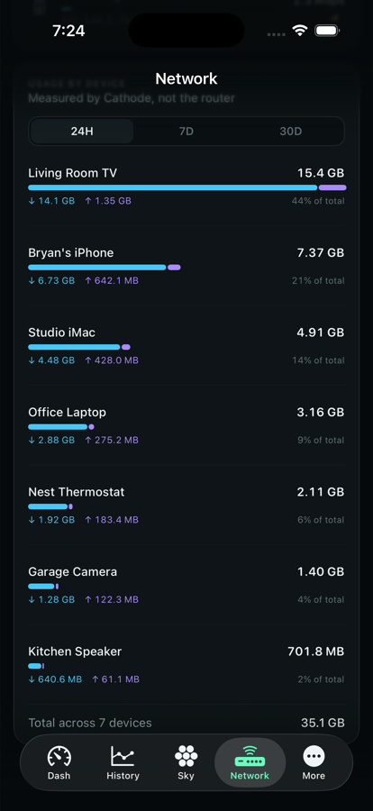

# Cathode

**A local-first instrument panel for your Starlink dish. iPhone and iPad.**

Cathode reads the dish directly over your own network, using the local gRPC API
the hardware already exposes. No account, no cloud service, no telemetry, no
third-party dependencies — just the app and the hardware.

If it's useful to you, you can [support the project](https://buymeacoffee.com/myevcompanionapp).

<p align="center">
  
  
  
  
</p>

> **Status.** Complete and working, verified end to end in the iOS Simulator
> against a built-in dish simulator that speaks the real wire protocol. It has
> **not yet been run against physical hardware** — see [Limits](#limits) before
> relying on it.

---

## Why it exists

Starlink's own app tells you whether the dish is online. It will not tell you
whether last Tuesday was worse than the Tuesday before, which direction the tree
is blocking, or whether the thing ruining your calls is an obstruction or your
cell running out of capacity.

The dish already knows all of that. It publishes far more than any interface
shows, throws most of it away after twelve hours, and forgets everything on
reboot. Cathode reads it, keeps it, and tries to answer the question behind the
question — not *what is the number*, but *what should I do about it*.

## What it shows you

### Is it working right now?

A health score, a live throughput ribbon with download above the axis and upload
mirrored below, and the numbers people actually check: latency, packet loss,
power draw, obstruction. Polled once a second. Outages draw as bands, so a gap
reads as *no data* rather than as zero.

### Why does it keep dropping?

Every lost second is **attributed to a cause**. An obstruction and a second
where the network had no slot to give you look identical on a throughput chart
and have nothing in common — one is fixed with a chainsaw, the other is Starlink
capacity in your cell. Cathode separates them, and the parts reconcile exactly
against the total.

**Signal-to-noise history** tells weather from trees: a broad sag with no
obstruction is rain or snow; a blockage cuts sharply, always in the same patch of
sky.

### Where exactly is it blocked?

The dish's 123×123 SNR grid, drawn as a polar sky dome. The boresight marker
eases along each satellite pass and leaves a fading track, so you can see the arc
of sky in use and count the handoffs — a terminal switches satellites every
fifteen seconds, and a single jumping dot shows none of that.

The **placement advisor** goes past what the hardware will tell you. Starlink
reports *how much* sky is blocked, never *where*. Cathode reduces the grid into
angular wedges and turns the worst one into an instruction you can follow while
standing outside: which direction, how high it reaches, which way to move, and
roughly how much of the problem that one direction accounts for.

### Is it getting worse?

History at two resolutions — every second for 48 hours, every minute forever —
so ranges from one hour to thirty days all query instantly. Throughput, latency,
reliability, power, and a **95th-percentile latency** line, which is the figure
that predicts whether calls hold up and the one an average hides completely.

Plus availability with downtime accounted for, data moved, energy consumed with a
monthly projection, an hour-of-day profile showing where congestion lands, and a
trend pass that says what changed against a longer baseline.

### Who is using all the data?

The router only reports a running lifetime total per device, which answers the
wrong question. Cathode samples those counters and stores the differences, then
ranks devices by what they actually used today, this week, or this month.

### Should I do something about it?

An alert engine watching latency, loss, obstruction, signal, throughput floor and
stability — with editable thresholds, and a remedy attached wherever there is
one. Anything at or above your chosen severity arrives as a notification,
deduplicated per alert so a flapping link cannot produce a storm, and withdrawn
once the problem clears.

### The rest

- **Speed test** with a bufferbloat grade. A speed number says how fast a
  download finishes; it says nothing about whether a call survives *while* that
  download runs. Cathode measures latency under load and grades it A+ to F.
- **Controls** — reboot, stow and unstow, reset the obstruction map, sleep
  schedule, snow melt. Every mutating action confirms first.
- **Diagnostics** — connection detail, a capability probe that asks the hardware
  which operations it implements, and a read-only console that dumps any
  response as an inspectable field tree.
- **Accessible** — the dome is a rendered bitmap, so VoiceOver gets a spoken
  summary instead: how much sky is blocked, where the dish is pointing, how much
  of the dome has been surveyed. Tiles read as one statement, not four
  fragments.
- **Demo mode** — a full behavioural simulation, so the app is explorable with
  no hardware at all. It is the default on first run and never sends
  notifications.

## What makes it different

**It finds the dish itself.** There is no address to look up or type. The dish
answers on a fixed management address regardless of the subnet your router hands
out — even in bypass mode behind third-party equipment — so Cathode probes that,
the default router address, and this device's own gateway in parallel, and adopts
whatever actually speaks the Device API. Identification is by `getDeviceInfo`, so
a NAS that happens to have the port open is not mistaken for a dish.

**No dependencies.** The dish speaks gRPC-web over plain HTTP/1.1, which
`URLSession` can do unaided — so the protobuf codec and gRPC framing are written
from scratch, about 780 lines. No gRPC library, no protobuf toolchain, no chart
library beyond Apple's own. Every import is a system framework.

**The simulator emits real protobuf.** It would have been easier to return typed
values, but then demo mode would exercise none of the framing, field numbering or
decode logic. Instead it produces the same bytes hardware would. Every wire-layer
bug found during development surfaced this way rather than waiting for someone to
plug in a dish.

**It says what it does not know.** Values stay optional all the way to the view,
so a dish that does not report power shows an em dash, never `0 W`.

## Getting it running

Requires **Xcode 16+** (built against Xcode 26.6 / Swift 6.3) and **iOS 18+**.

```bash
open Cathode.xcodeproj
```

Pick the **Cathode** scheme and run. It opens in demo mode, so it works
immediately in the Simulator with nothing else set up.

From the command line:

```bash
xcodebuild -project Cathode.xcodeproj -scheme Cathode -destination 'platform=iOS Simulator,name=iPhone 17' build
```

For real hardware: join the Starlink network and switch **More → Connection → My
Starlink**. Cathode finds the dish on its own.

## Tests

```bash
./Tests/run.sh
```

A dependency-free harness that compiles the platform-independent core and runs
60 checks over it. These cover the places where a mistake is invisible in the UI
— a mis-decoded array still draws a chart, it just draws the wrong one.

Three real bugs were caught this way and each is pinned by a test:

| Bug | Why it was invisible |
| --- | --- |
| Packed-float element width was being sniffed from the data | 43 200 float32s is also a valid byte length for float64s, and watt values reinterpret into plausible-looking doubles around 1e12 |
| Rollups double-counted bytes | The poll loop deliberately re-reads the dish's ring buffer; ignored duplicate inserts still entered the rollup buffer |
| Obstructed seconds were also marked unscheduled | Made every obstruction count as congestion — the exact conflation the lost-time chart exists to remove |

## How it talks to the dish

The dish exposes a gRPC service, `SpaceX.API.Device.Device`. Every operation
travels over a single method, `Handle`, as one arm of a protobuf `oneof` — so the
whole API surface reduces to `call(op:)`.

| Endpoint | Port | Protocol | Used |
| --- | --- | --- | --- |
| `192.168.100.1` | 9200 | native gRPC over HTTP/2 | no — needs trailers `URLSession` does not expose |
| `192.168.100.1` | 9201 | gRPC-web over HTTP/1.1 | **yes** |
| `192.168.1.1` | 9000 | router, same service | yes, when present |

Two iOS specifics live in `Config/Info.plist`: the dish is HTTP-only, so there is
a scoped App Transport Security exception for its addresses; and reaching a LAN
address triggers the local-network privacy prompt, which the app explains and
reports clearly if declined.

### On working against an undocumented API

Starlink's Device API is not publicly documented. The field numbers in
`Core/Starlink/DishSchema.swift` are the community-known layout used across the
open-source tooling ecosystem — a well-supported starting point, **not a
specification**, and not something this project can verify against every
firmware revision.

So Cathode is built to degrade honestly rather than to be confidently wrong:

- Responses are decoded **structurally**, by field number and wire type, not
  against a compiled schema. New fields in a firmware update do not break
  parsing, and a field that cannot be found reads as *unknown* rather than as a
  plausible wrong number.
- Packed array element width comes from the schema, never from inspecting the
  bytes.
- **Diagnostics → Supported operations** probes the hardware and reports what it
  actually answers, so an operation whose number has moved shows up as
  unsupported instead of as bad data.

If something decodes wrong on your hardware, the request console in Diagnostics
dumps the raw field tree. That output is the useful thing to report.

## Architecture

```
Cathode/
├── Core/                  no UIKit, no SwiftUI — fully testable
│   ├── Protobuf/          wire-format reader and writer
│   ├── Grpc/              framing, transport protocol, gRPC-web over URLSession
│   ├── Discovery/         finds Starlink hardware on the local network
│   ├── Starlink/          types, field map, decoders, client actor
│   ├── Sim/               behavioural dish model + a transport that encodes it
│   ├── Store/             SQLite history with two-tier rollups
│   └── Analytics/         alert engine, grading, obstruction advisor, trends
├── DesignSystem/          palette, type scale, shared components, formatters
├── App/                   entry point, model, settings, poll loop,
│                          notifications, background refresh
├── Features/              one folder per screen
└── Config/Info.plist
```

39 Swift files, roughly 9 900 lines, of which 3 900 are the platform-independent
core.

`DishTransport` is the seam. Both the real gRPC-web transport and the simulator
conform to it, so nothing above that layer knows which one it is talking to.

**One poll loop drives everything.** Status reads every second; the obstruction
map, router client list and location run on their own deadlines, so a
15 129-cell SNR grid never blocks the live numbers. Those deadlines are
time-based rather than counted in poll ticks, so a reconnect or a cancelled loop
cannot desynchronise them.

**The dish simulator is a model, not a random walk.** Satellite handoffs land on
15-second boundaries and the boresight tracks each pass across the sky.
Obstructions are fixed objects that only bite when the tracked satellite passes
behind one. Household demand follows a diurnal curve with bursty streaming. Rain
fade degrades SNR and throughput together. Power tracks load, plus a heater draw
when it is cold.

## Privacy

Cathode reads from your dish and writes to your device. That is the entire data
flow.

- No account, no sign-in, no server.
- No analytics, crash reporting, or telemetry of any kind.
- History lives in the app's container and is deleted with the app. You can
  erase it at any time from **More → Recorded history**.
- The only network destinations the app ever contacts are the local addresses in
  the table above.

## Limits

Stated plainly, because a monitoring tool that overstates itself is worse than
none.

- **Not yet tested against physical hardware.** Demo mode exercises the full
  wire path, but the live connection to a real dish has never been run. The
  fixed-address assumption and the field numbers are well established; they are
  still the kind of thing only hardware confirms.
- **Background alerts only work at home.** Cathode reads the dish over the local
  network, so a background check only succeeds while the device is on that
  network. Away from home you will not be alerted. There is no cloud relay —
  which is the same reason there is no account.
- **SNR is absent on newer firmware.** Recent builds leave the series at zero.
  The chart hides itself rather than drawing an empty axis.
- **Data usage is what Cathode saw.** Totals reflect the periods the app was
  running to observe them, not your true billed usage.
- **iPad runs the phone layout.** It builds and works, but has no split-view
  design yet.
- **The 95th-percentile figure is per-minute.** A true percentile across a month
  would need the raw samples, which are discarded after 48 hours. What is shown
  is the worst per-minute p95 in each bucket — the number that tracks how bad it
  actually gets.

## Relationship to Dishylink

Cathode began as an iOS answer to
[Dishylink](https://github.com/DaveyHert/Dishylink), an open-source Starlink
monitor for desktop and browsers, and covers the same ground: live stat tiles,
throughput and latency and power charts, the obstruction dome, alignment, device
usage, event logs, speed tests, alerts, and the dish and router controls.

Native iOS rather than Electron; history that survives past the session;
availability and energy reporting; lost time attributed by cause; the placement
advisor; bufferbloat grading; automatic discovery; and no dependencies at all.

## License

MIT.

Not affiliated with, endorsed by, or sponsored by SpaceX or Starlink. Starlink is
a trademark of Space Exploration Technologies Corp.
